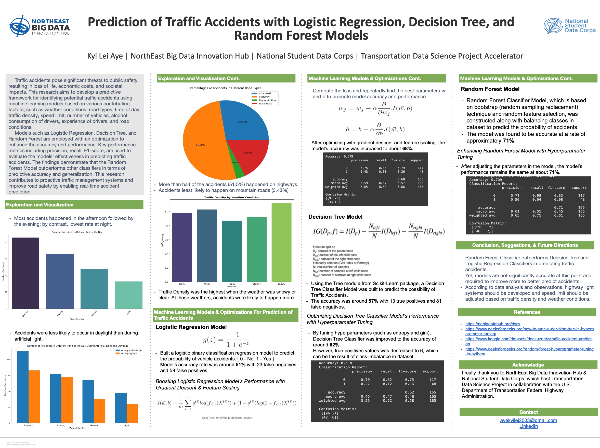

# NEBDHub + NSDC Transportation Data Science Project (TDSP) Accelerator

### Mission
By using [NYC OpenData Motor Vehicle Collisions - Crashes dataset](https://data.cityofnewyork.us/Public-Safety/Motor-Vehicle-Collisions-Crashes/h9gi-nx95/about_data),
- To understand where and why the roadway fatalities happen and how we can help prevent them.
- To reduce vulnerable road user fatalities and keep people safer

This project is hosted by the [Northeast Big Data Innovation Hub](https://nebigdatahub.org/about/) &amp; [National Student Data Corps](https://nebigdatahub.org/nsdc/), in collaboration with the [U.S. Department of Transportation Federal Highway Administration](https://highways.dot.gov/).

There are 6 milestones in this project.
* Data preparation
* Data ethics processing
* Time series analysis
* Geospatial analysis
* Self-guided research 
* Virtual Poster 

### Reference for dataset
https://nebigdatahub.org/dsrr/
